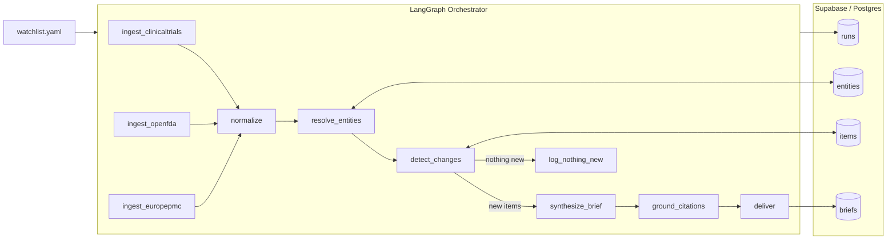

# PipelineRadar

**Autonomous competitive-intelligence agent for life sciences.**

PipelineRadar wakes on a schedule, scans public clinical-trial, drug-approval, and literature sources for a configured watchlist, resolves the same entities across all sources, detects what is genuinely new since the last run, and delivers a sourced intelligence brief — with zero human prompting.

It is not a chatbot. It is a scheduled, stateful, multi-agent system built on LangGraph.

[](https://www.python.org/)
[](https://github.com/langchain-ai/langgraph)
[-blueviolet.svg)](https://anthropic.com)
[](https://supabase.com)
[](LICENSE)

---

## What it does

Pharma commercial and medical-affairs teams track competitor activity — new trials, readouts, approvals, publications — across a therapeutic area. The data is entirely public but fragmented across a dozen sources, and staying current is a manual, never-finished chore. PipelineRadar automates it end to end.

On each scheduled run it:

1. Ingests new records from ClinicalTrials.gov, openFDA, and Europe PMC concurrently
2. Resolves every drug, company, and target to a canonical entity — across sources that all name things differently
3. Detects what has genuinely changed since the last run (skips synthesis entirely if nothing is new)
4. Synthesizes a per-therapeutic-area intelligence brief, grounded strictly in retrieved data
5. Verifies every citation against the actual retrieved items before delivery — hallucinated sources are flagged, not silently included
6. Delivers the brief by email and persists it to a searchable history

---

## Architecture



### Agent nodes

| Node | Type | Responsibility |
|---|---|---|
| `ingest_clinicaltrials` | async IO | Studies matching watchlist from ClinicalTrials.gov API v2 since last run |
| `ingest_openfda` | async IO | Recent drug approvals from openFDA |
| `ingest_europepmc` | async IO | New publications from Europe PMC |
| `normalize` | deterministic | Maps raw records to a canonical `Item` schema |
| `resolve_entities` | hybrid | Maps drug/company/target names to canonical entities (see below) |
| `detect_changes` | deterministic | Diffs against `seen_items`; produces `new_items` only |
| `synthesize_brief` | LLM | Writes a per-TA brief strictly from `new_items` |
| `ground_citations` | hybrid | Verifies every cited item ID actually exists in retrieved data |
| `deliver` | async IO | Renders markdown, sends email, persists brief |

---

## Entity resolution

The hardest engineering problem in PipelineRadar is that the same entity appears differently across every source — "Keytruda" on ClinicalTrials, "pembrolizumab" on openFDA, "MK-3475" in a publication abstract. Naïve string matching fails silently and corrupts the change-detection layer.

The resolver uses a three-layer strategy:

**Layer 1 — Deterministic normalization.** Lowercasing, punctuation stripping, suffix removal ("Inc", "Corp", "& Co"), and a hardcoded alias map (`aliases.py`) covering known brand→generic mappings and company name variants. Covers ~95% of real-world cases instantly, with no I/O cost.

**Layer 2 — Registry lookup.** A query against the `entities` table on `canonical_name` and the `aliases` JSONB field. If the entity was resolved before, it is returned immediately — no LLM involved.

**Layer 3 — LLM disambiguation fallback.** Only reached for genuinely ambiguous names that survive Layers 1 and 2. The LLM receives the raw name plus item context and returns a canonical name and kind as structured JSON (validated with Pydantic). The result is written to the registry immediately — the same name will never reach Layer 3 twice.

This approach keeps the majority of resolutions deterministic, fast, and free, while preserving correctness on the long tail of ambiguous real-world names.

---

## Hallucination detection

PipelineRadar actively verifies citations before delivery rather than trusting LLM output. The `ground_citations` node checks every `source_item_id` in a synthesized claim against the actual list of retrieved items passed to the synthesizer. If an ID does not exist in that list, the claim is flagged `UNVERIFIED` and rendered with a visible warning in the brief — it is never silently dropped or silently included.

This is visible in the live demo brief below: the CNS cancers claim was flagged `⚠ UNVERIFIED` because one of its cited IDs did not match the retrieved item set. A human reviewer sees it before the brief is distributed.

---

## Live demo — real output

Brief generated on **June 10, 2026** · Watchlist: nivolumab, pembrolizumab · Therapeutic area: oncology · Run ID: `3d816cb6`

```markdown
# PipelineRadar Intelligence Brief
**Therapeutic Area:** oncology
**Generated:** 2026-06-10 10:36 UTC
**Run ID:** 3d816cb6-f4c6-4470-81ce-d1c240198042

---

## Clinical Trials

- Nivolumab is being investigated in combination with ipilimumab across
  multiple cancer types including soft tissue sarcoma, melanoma, and
  basal cell carcinoma. [1] [2] [3]
- Nivolumab in combination with brentuximab vedotin is being evaluated
  for the treatment of older patients with untreated Hodgkin lymphoma. [4]
- Concurrent nivolumab and external beam radiation therapy is under
  investigation for patients with advanced hepatocellular carcinoma. [5]
- Nivolumab combined with cetuximab is being studied as a neoadjuvant
  treatment following chemoradiation in locally advanced esophageal
  squamous cell carcinoma. [6]
- Multiple clinical trials are evaluating nivolumab for central nervous
  system cancers, including primary CNS lymphoma and brain metastases
  from non-small cell lung cancer. [7] [8] [9]
  > ⚠ UNVERIFIED — review before distributing

---

### Sources
[1] ClinicalTrials NCT05836571  [2] ClinicalTrials NCT02714218
[3] ClinicalTrials NCT03521830  [4] ClinicalTrials NCT02758717
[5] ClinicalTrials NCT04611165  [6] ClinicalTrials NCT04229459
[7] ClinicalTrials NCT03173950  [8] ClinicalTrials NCT02696993
[9] ClinicalTrials NCT03770416
```

All NCT identifiers above are real ClinicalTrials.gov records.

---

## Tech stack

| Layer | Technology |
|---|---|
| Orchestration | LangGraph (stateful async graph) |
| LLM | Claude via Anthropic SDK · Azure OpenAI swappable via `llm/provider.py` |
| Ingestion | httpx (async) · ClinicalTrials.gov API v2 · openFDA · Europe PMC |
| Schemas | Pydantic v2 (typed boundaries throughout) |
| Persistence | Supabase (Postgres) — entities, items, runs, briefs |
| Scheduling | APScheduler (AsyncIOScheduler, cron-configurable) |
| API | FastAPI — `/run`, `/run/force`, `/status/{run_id}`, `/briefs` |
| Quality | ruff · mypy · pytest + respx |

---
## Architecture
...
> Full design rationale and data model in [docs/ARCHITECTURE.md](docs/ARCHITECTURE.md).

## Setup

**Prerequisites:** Python 3.11+, `uv`, a Supabase project, an Anthropic API key.

```bash
git clone https://github.com/anupaminnit/pipelineradar
cd pipelineradar
uv sync
cp .env.example .env   # fill in SUPABASE_URL, SUPABASE_SERVICE_KEY, ANTHROPIC_API_KEY
```

Run the Supabase migration in `db/migrations/001_initial.sql` via the Supabase SQL editor.

Configure your watchlist:

```yaml
# config/watchlist.yaml
therapeutic_areas:
  - oncology

drugs:
  - pembrolizumab
  - nivolumab

companies:
  - "Merck Sharp & Dohme"
  - "Bristol Myers Squibb"

targets:
  - PD-1

schedule:
  cron: "0 7 * * *"
  timezone: "Asia/Kolkata"
```

**Run modes:**

```bash
# Verify config and DB connection — no fetching
python -m pipelineradar.main --dry-run

# Single run with change detection active
python -m pipelineradar.main --once

# Demo mode — synthesizes all items regardless of seen state
python -m pipelineradar.main --force

# Production mode — autonomous scheduled runs
python -m pipelineradar.main

# API server
uvicorn pipelineradar.api:app --reload
```

**API endpoints:**

```
POST /run              Trigger a single run
POST /run/force        Trigger a force-mode run (demo)
GET  /status/{run_id}  Run status and item counts
GET  /briefs           Recent brief history
GET  /briefs/{id}      Full brief with body and citations
```

---

## Project structure

```
src/pipelineradar/
  config.py                  # env + watchlist loader
  schemas.py                 # Pydantic models: Item, Entity, Brief, RunState
  llm/provider.py            # LLM abstraction (Claude default, Azure swappable)
  db/client.py               # Supabase client + typed queries
  db/migrations/             # SQL schema
  ingest/                    # One async client per source, with retry/backoff
  resolve/entity_resolver.py # Three-layer entity resolution
  resolve/aliases.py         # Hardcoded alias map (brand → generic, etc.)
  detect/change_detector.py  # Content-hash-based change detection
  detect/hashing.py          # Deterministic SHA-256 item hashing
  synthesize/brief_agent.py  # LLM brief synthesis
  synthesize/citation_grounder.py  # Hallucination detection + citation attachment
  synthesize/prompts.py      # Prompt templates
  deliver/email.py           # SMTP delivery with HTML rendering
  deliver/markdown.py        # Markdown renderer + brief persistence
  graph/                     # LangGraph state, nodes, graph wiring
  scheduler.py               # APScheduler autonomous loop
  api.py                     # FastAPI endpoints
  main.py                    # CLI entrypoint
tests/
config/watchlist.yaml
output/                      # File-fallback briefs (gitignored)
```

---

## Data sources

All sources are free, public, and require no scraping.

| Source | What it provides |
|---|---|
| [ClinicalTrials.gov API v2](https://clinicaltrials.gov/data-api/api) | Clinical study registrations and updates |
| [openFDA](https://open.fda.gov/apis/) | Drug approval submissions and actions |
| [Europe PMC](https://europepmc.org/RestfulWebService) | Biomedical literature and preprints |

---

## Roadmap

- [x] Phase 0 — Scaffold, config, schema, DB
- [x] Phase 1 — Ingestion + normalization (3 sources, real data)
- [x] Phase 2 — Entity resolution + change detection
- [x] Phase 3 — LLM synthesis + citation grounding
- [x] Phase 4 — Email delivery + APScheduler + FastAPI
- [ ] Phase 5 — React dashboard (watchlist editor, brief history, entity timeline)
- [ ] Phase 6 — Faithfulness eval + structured logging + token/cost metrics per run

---

## Author

**Anupam Singh** · [github.com/anupaminnit](https://github.com/anupaminnit)  
Gen AI Developer · LangGraph · Azure OpenAI · RAG · Agentic Systems
